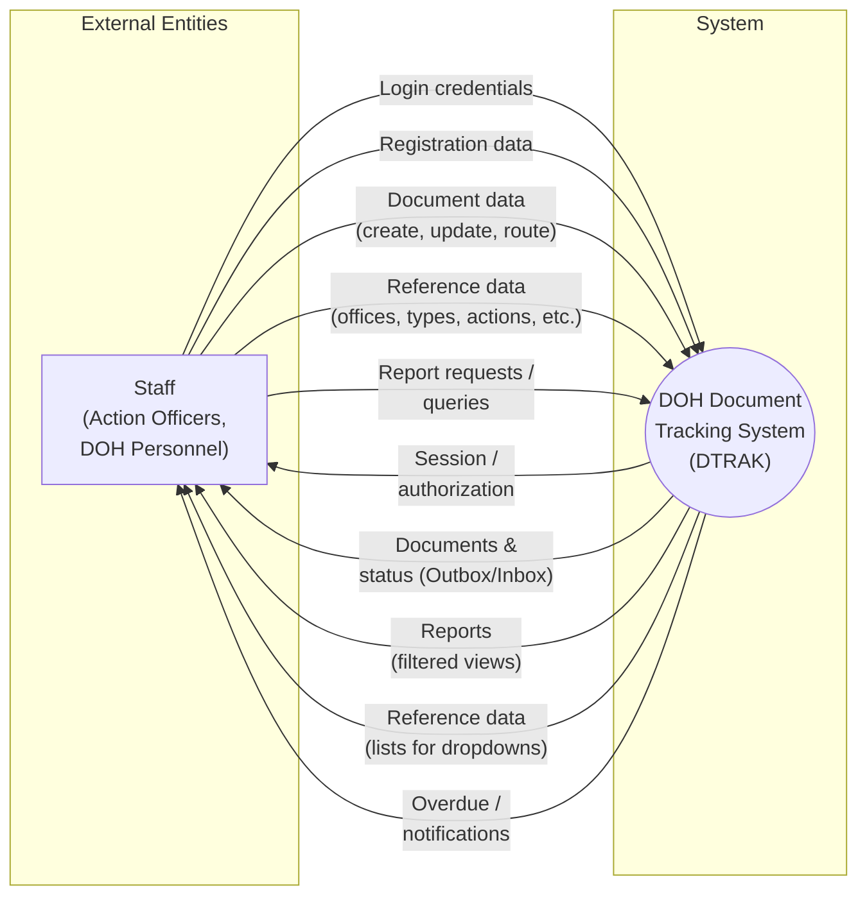

# Data Flow Diagram — Context Diagram (Level 0)

**System:** DOH Document Tracking Information System (DTRAK Region IX)

The context diagram shows the system as a single process and the data flows between the system and external entities.

---

## Context Diagram

---

## Elements

| Element | Description |
|--------|--------------|
| **Staff** | External entity: DOH personnel (action officers, admins) who use the system to track and manage documents. |
| **DOH Document Tracking System (DTRAK)** | The system as one process: web app (React frontend + Django API + Supabase). |
| **Arrows** | Data flows. Labels describe what is sent (e.g., login credentials, document data, reports). |

---

## Data Flows Summary

| Direction | Flow | Description |
|-----------|------|--------------|
| Staff → System | Login credentials | Email/password for authentication. |
| Staff → System | Registration data | New account (name, employee code, office, user level, etc.). |
| Staff → System | Document data | Create/update documents, routing, destinations, attachments. |
| Staff → System | Reference data | CRUD on offices, document types, action required, action officers, etc. |
| Staff → System | Report requests | Filters and criteria for reports (date, office, control no., etc.). |
| System → Staff | Session / authorization | Login result, session, permissions. |
| System → Staff | Documents & status | Outbox/Inbox lists, document details, status. |
| System → Staff | Reports | Report results (by date, office, control no., overdue, audit trail, etc.). |
| System → Staff | Reference data | Lists used in forms and dropdowns. |
| System → Staff | Overdue / notifications | Office-with-overdue and related alerts. |

---

*This is the Level 0 (context) diagram. Lower-level DFDs can decompose the single process into subprocesses (e.g., Authentication, Document Management, Reporting).*
